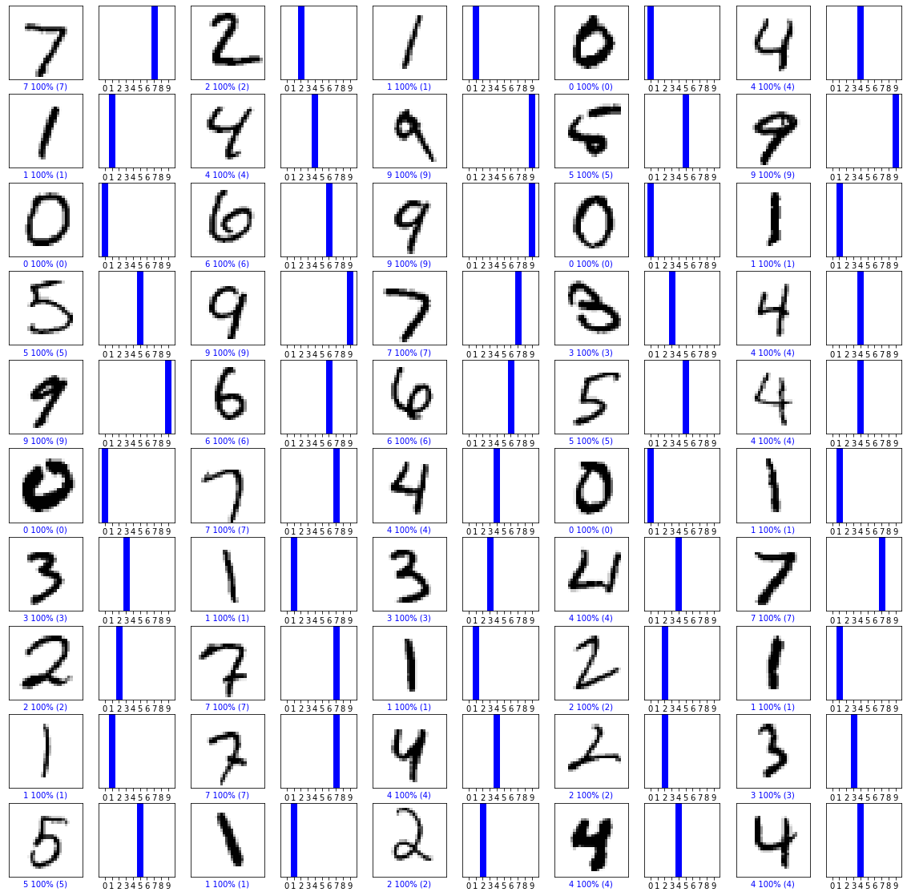
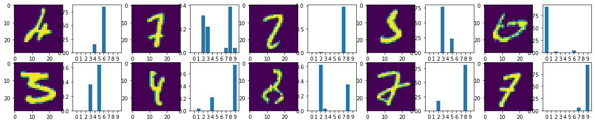

"# Algorithm_04" 
# Algorithm_04

## Model 1 : 3 Layers with 1 Convolution layer

```python
model = keras.models.Sequential([
        keras.layers.Conv2D(32, (3,3), activation = 'relu', input_shape = (28, 28,1)),  # layer 1 
        keras.layers.MaxPool2D((2,2)),                                                  # layer 2 
        keras.layers.Flatten(),
        keras.layers.Dense(10, activation = 'softmax')])                                # layer 3
```

```python
model.fit(train_images, train_labels,  epochs = 5)
```
    Train on 60000 samples
    Epoch 1/5
    60000/60000 [==============================] - 23s 377us/sample - loss: 0.4812 - accuracy: 0.9421
    Epoch 2/5
    60000/60000 [==============================] - 22s 362us/sample - loss: 0.0816 - accuracy: 0.9756
    Epoch 3/5
    60000/60000 [==============================] - 22s 360us/sample - loss: 0.0693 - accuracy: 0.9796- loss: 0.0692 - accuracy:  - ETA: 0s - loss: 0.0691 
    Epoch 4/5
    60000/60000 [==============================] - 22s 364us/sample - loss: 0.0612 - accuracy: 0.9813
    Epoch 5/5
    60000/60000 [==============================] - 22s 360us/sample - loss: 0.0510 - accuracy: 0.9841

    <tensorflow.python.keras.callbacks.History at 0x1be6b3bc648>


```python
test_loss, accuracy = model.evaluate(test_images, test_labels, verbose = 2)
print('\nTest loss : ', test_loss)
print('Test accuracy :', accuracy)
```

### Accuracy
    10000/1 - 2s - loss: 0.0598 - accuracy: 0.9752
    
    Test loss :  0.10628799562671629
    Test accuracy : 0.9752
    
    Prediction :  (10000, 10)
    Test labels :  (10000,)

### Plot of successfully predicted images and probability


### Plot of wrong predicted images and probability



## Model 2 : 5 Layers with 2 Convolution layer

```python
model = keras.models.Sequential([
        keras.layers.Conv2D(32, (3,3), activation = 'relu', input_shape=(28,28,1)),     # layer 1 
        keras.layers.MaxPool2D((2,2)),                                                  # layer 2
        keras.layers.Conv2D(64, (3,3), activation = 'relu'),                            # layer 3 
        keras.layers.MaxPool2D((2,2)),                                                  # layer 4
        keras.layers.Flatten(),
        keras.layers.Dense(10, activation = 'softmax')])                                # layer 5
```


Model 3 : 7 Layers with 4 Convolution layer

```python
model = keras.models.Sequential([
        keras.layers.Conv2D(32, (3,3), activation = 'relu', input_shape = (28, 28,1)),  # layer 1
        keras.layers.MaxPool2D((2,2)),                                                  # layer 2
        keras.layers.Conv2D(64, (3,3), activation = 'relu'),                            # layer 3
        keras.layers.Conv2D(64, (3,3), activation = 'relu'),                            # layer 4
        keras.layers.MaxPool2D((2,2)),                                                  # layer 5
        keras.layers.Conv2D(128, (3,3), activation = 'relu'),                           # layer 6
        keras.layers.Flatten(),
        keras.layers.Dense(10, activation = 'softmax')])                                # layer 7
```

